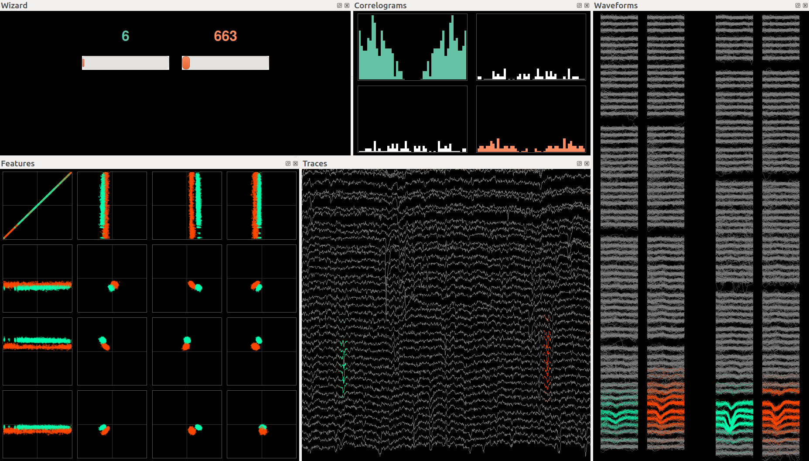

## Manual clustering

The manual clustering subpackage (`phy.cluster.manual`) provides a programmatic Python API as well as a lightweight graphical interface to manually refine the output of the automatic clustering algorithm.

Although you can use the `phy cluster-manual` command-line tool to open the GUI, you can also access it from IPython (terminal or notebook) for more control.

### Session

You can launch the clustering GUI from the session.

**Important**: you need to enable Qt integration first:

```python
>>> import phy
>>> phy.enable_qt()
12:52:52 [I] Qt event loop activated.
```

Let's open a new session:

```python
>>> from phy.cluster import Session
```

```python
>>> kwik_path = 'data/hybrid_10sec.kwik'
>>> session = Session(kwik_path)
Features and masks initialized.
Waveforms initialized.
Statistics initialized.
```

> Putting your data files on a SSD is **highly recommended** for performance reasons.

### Manual clustering GUI

Type `session.show_gui()` to launch the clustering GUI. This minimal GUI provides two things:

* A window where to dock visualization widgets.
* Keyboard shortcuts to go through your best clusters and a list of potential merge candidates (**wizard**).

> Type `ctrl+h` to see the list of keyboard shortcuts.

The wizard is there to save you a lot of time clustering your data manually. It makes you propositions with 1 or 2 clusters, and you have to decide an outcome based on the views in the window.

Here is the intended workflow:

* Initially, the **best** cluster found is shown. You can explore it in the various views (waveforms, features, traces, ACG).
* Use `space` and `shift+space` to scroll through your best clusters by decreasing quality.
* At any point, you can **pin** a cluster by pressing `enter`. Then you'll see a second cluster selected: this is the **closest match**. Unpin with `backspace`.
* When a cluster is pinned, scroll through the list of closest matches with `space` and `shift+space`. The pinned cluster stays selected.
* You have keyboard shortcuts to:
    * Merge the two displayed clusters.
    * Move either or both clusters to cluster groups (noise, MUA, good).
* You can also draw a lasso in the feature view to create a new cluster out of the enclosed spikes (`ctrl+click` and `k` to split).



All actions are accessible from the Python API. Use tab completion on `session.gui` and look at the [API](https://github.com/kwikteam/phy-doc/blob/master/api.md#phyclustermanualclustermanualgui).

```python
>>> gui = session.show_gui()
```

## Custom wizard

You can define your own quality and similarity functions. For example, we can sort the clusters by increasing number with this:

```python
>>> @gui.wizard.set_quality_function
... def cluster_id(cluster):
...     # The clusters are sorted by decreasing quality.
...     return -cluster
```

```python
>>> gui.wizard.start()
```

Similarly, there is the `@gui.wizard.set_similarity_function` decorator.

### Changing the shank or clustering

```python
>>> session.change_channel_group(0)
12:59:27 [I] Switched to channel group 0.
Features and masks initialized.
Waveforms initialized.
Statistics initialized.
```

```python
>>> session.change_clustering('original')
12:59:29 [I] Switched to `original` clustering.
Features and masks initialized.
Waveforms initialized.
Statistics initialized.
```

### User settings

You can put custom settings in `~/.phy/user_settings.py`.

For example, to add a new CCG view with custom parameters by default in all GUIs, put this in your settings file:

```
gui_config = [
    ('wizard', {'position': 'right'}),
    ('features', {'position': 'left'}),
    ('correlograms', {'position': 'left'}),
    ('correlograms', {'position': 'left',
                      'binsize': 5,
                      'winsize_bins': 4*100}),
    ('waveforms', {'position': 'right'}),
    ('traces', {'position': 'right'}),
]
```

### Internal settings

Some internal settings (especially related to the views and the GUI, such as the position of the views) are automatically saved in `~/.phy/internal_settings` (a JSON file). You can delete this file if you have some strange bugs in the GUI.

You can also set some settings manually:

```python
>>> session.settings['hello'] = 'world'
```

```python
>>> session.settings.save()
```

```python
>>> !cat ~/.phy/internal_settings
{
  "hello": "world"
}
```
